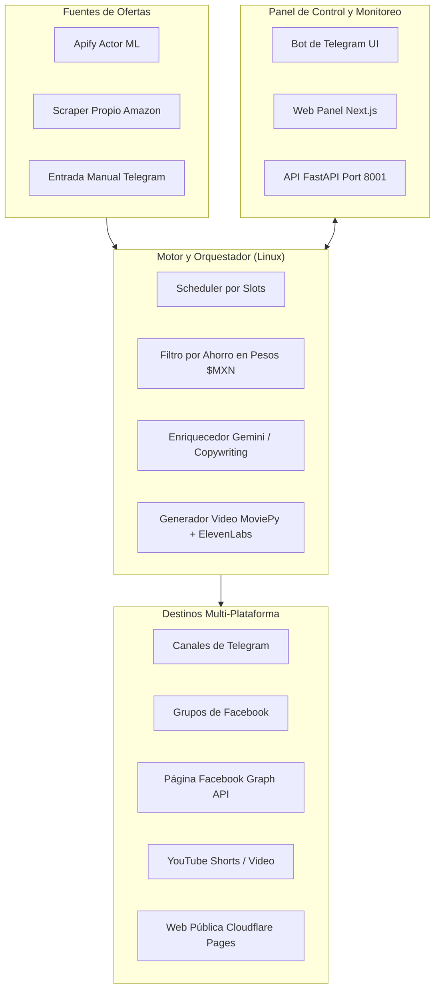

# 🛒 Sistema Automatizado de Afiliados — Gangas MX

> Sistema integral de monitoreo, scraping, enriquecimiento con IA y publicación automatizada de ofertas de **Mercado Libre** y **Amazon** en múltiples canales y redes sociales (Telegram, Facebook, YouTube Shorts, Web).

---

## 📚 Índice de Documentación del Sistema

Toda la documentación técnica, manuales y guías operativas se encuentran organizadas en los siguientes documentos clave:

| Documento | Descripción | Audiencia / Propósito |
|---|---|---|
| 📖 [**`MANUAL.md`**](MANUAL.md) | **Guía de Restauración y Respaldos.** Explica cómo clonar y levantar el sistema en una PC nueva en 3 minutos con `setup.ps1` y cómo respaldar secretos en Google Drive. | Restauración, Migración y Disaster Recovery |
| ⚡ [**`LEEME_COMANDOS.md`**](LEEME_COMANDOS.md) | **Guía rápida de comandos.** Comandos para arrancar la API, el Web Panel, ver logs en vivo (`journalctl`) y reiniciar servicios en Linux (`gangas.target`). | Operación diaria y soporte rápido |
| 🧠 [**`CONTEXTO_SISTEMA.md`**](CONTEXTO_SISTEMA.md) | **Arquitectura completa del sistema.** Documenta el entorno dual Windows-Linux, Syncthing, las 5 colas por nicho, el pipeline de video con ElevenLabs, reglas de negocio y métricas de ahorro en pesos. | Arquitectura, Ingeniería y Auditoría |
| 🤖 [**`AGENT_CONTEXT.md`**](AGENT_CONTEXT.md) | **Reglas de trabajo y directrices para Agentes de IA.** Reglas inquebrantables, checklist pre-flight, convenciones de código y prevención de regresiones. | Agentes IA (Claude, Gemini, Antigravity) |
| 🔐 [**`.env.example`**](.env.example) | **Plantilla de variables de entorno.** Todas las claves de API, IDs de Telegram, tokens de Facebook y configuración documentada sin valores reales. | Configuración inicial de entorno |

---

## 🏗️ Arquitectura General



---

## 💻 Entorno Dual (Windows ↔ Linux)

* **Windows (Desarrollo):** Edición de código, pruebas de interfaz en Next.js y scraping interactivo si se requiere sesión gráfica.
* **Linux (Producción):** Laptop dedicada que corre el orquestador 24/7 mediante `amazon_bot.service`, la API con `gangas_api.service` y el panel web detrás de un túnel de Cloudflare.
* **Sincronización:** Ambos equipos se mantienen sincronizados bidireccionalmente en tiempo real mediante **Syncthing**.

---

## 🚀 Inicio Rápido (Instalación en 1 Clic)

Si estás instalando el proyecto en una máquina nueva:

1. Clona el repositorio:
   ```bash
   git clone https://github.com/laloehm/System.git
   cd System
   ```
2. Restaura tu archivo `.env` (o cópialo desde tu respaldo privado de Google Drive).
3. Ejecuta el instalador automático:
   ```powershell
   powershell -ExecutionPolicy Bypass -File .\setup.ps1
   ```

---

## 🛠️ Tecnologías Principales

* **Backend & Orquestación:** Python 3.10+, FastAPI, Uvicorn, Aiohttp, Playwright.
* **Frontend Web Panel:** Next.js 15 (App Router), React, Tailwind CSS, TypeScript.
* **Inteligencia Artificial:** Google Gemini API (limpieza de títulos y ganchos), ElevenLabs (síntesis de voz).
* **Multimedia:** MoviePy, Pillow, Edge-TTS.
* **Infraestructura:** Linux Systemd (`gangas.target`), Cloudflare Tunnel, Cloudflare Pages, Syncthing.
